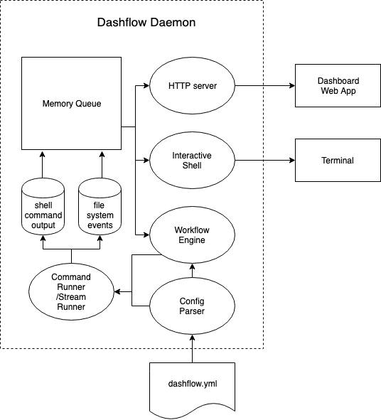

# Dashflow Contributor's Guide

## How to Start Local Development

1. `yarn install` to install required packages
2. `yarn link` to link current project so `dashflow` command becomes globally available
3.  local dev workflow
  a. We can definitely use dashflow itself for local dev workflow, just `dashflow` you'll be ready
  b. If you prefer the manual workflow, `yarn lint`, `yarn test`, and `yarn format` can be helpful

## How the Code is Organized

1. Directory Structure

```
├── CHANGELOG.md
├── CONTRIBUTOR.md
├── LICENSE
├── README.md
├── bin/                          # executables are located here
├── dashflow-sophisticated.yml    # a dashflow config for test
├── dashflow.yml                  # the config for local development
├── guide_assets                  # images for README.md
├── index.js                      # export functions to allow using dashboard as a library
├── lib/                          # source file for backend
├── package.json                  # dependencies and metadata
├── test/                         # test cases
├── web/                          # source file for web dashboard
└── yarn.lock                     # lock down specific dependency package version
```

2. Architecture



## How to Debug Issues

1. Run with DEBUG environment variable

```
# run with additional debug information
$ DEBUG="app:*" dashflow
$ DEBUG="events:*" dashflow
$ DEBUG="stream:*" dashflow
$ DEBUG="workflow:*" dashflow
$ DEBUG="*" dashflow
```

2. Run with `--verbose` flag

When we run dashflow with --verbose flag, we'll see full stacktrace for errors.
